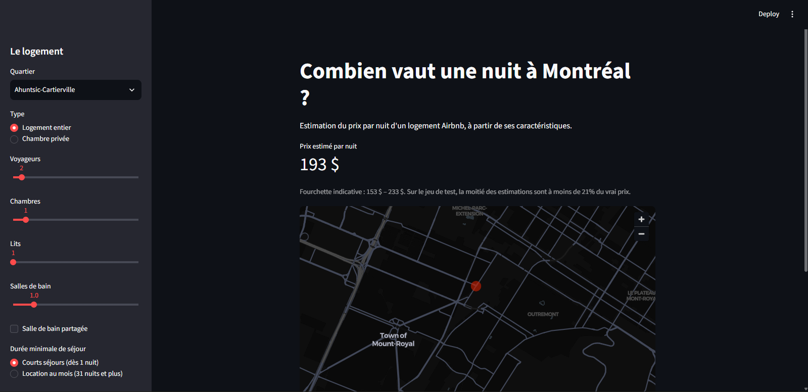
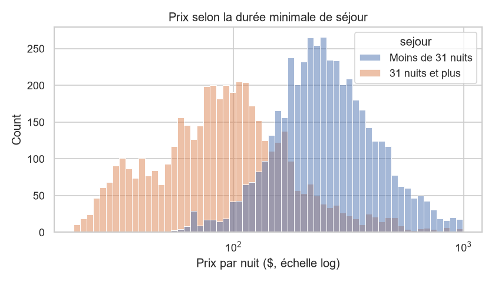
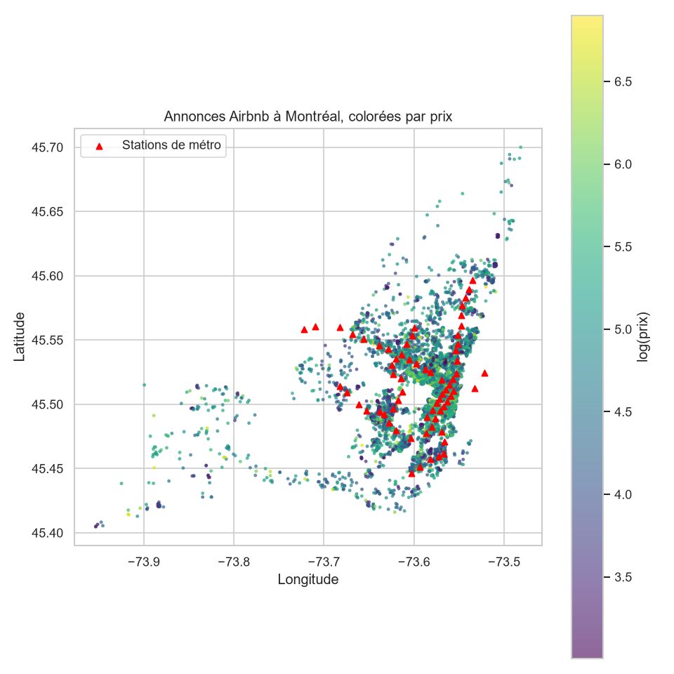
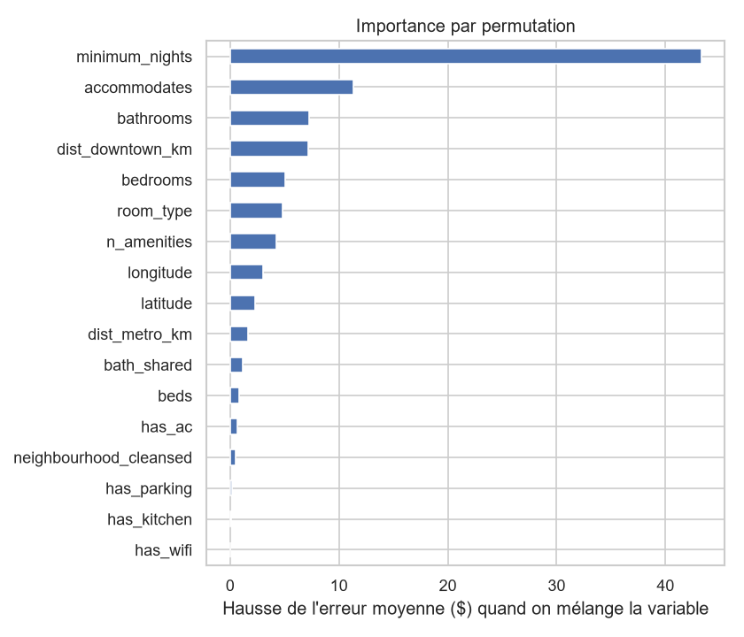

# Prix des Airbnb à Montréal

Prédire le prix par nuit d'un logement Airbnb à Montréal à partir de ses caractéristiques
et de son emplacement : données publiques, nettoyage, exploration, modèles scikit-learn
et app Streamlit.

**App en ligne :** [https://montreal-airbnb-price-prediction.streamlit.app/]



## En bref

- **9 165 annonces** Airbnb de Montréal, enrichies avec la position des **68 stations de métro**.
- Un **Random Forest** prédit le prix par nuit avec une **erreur moyenne de 52 $** sur des annonces
  jamais vues, contre **104 $** pour une référence naïve (prix médian du quartier). R² = **0,69**.
- La moitié des estimations sont à **moins de 21 %** du vrai prix.
- Découverte principale : **deux marchés** coexistent. Les locations au mois (31 nuits minimum)
  coûtent **90 $** la nuit en médiane, contre **245 $** pour les courts séjours.

## La question

Combien peut coûter une nuit dans un Airbnb à Montréal, selon sa taille, ses équipements
et sa distance au métro et au centre-ville ?

## Les données

| Source | Contenu | Licence |
|--------|---------|---------|
| [Inside Airbnb](https://insideairbnb.com/get-the-data/) | 10 656 annonces de Montréal (90 colonnes), instantané du 15 juin 2026 | CC BY 4.0 |
| [STM — données GTFS](https://www.stm.info/fr/a-propos/developpeurs) | Position des 68 stations de métro | Licence ouverte STM |

**Nettoyage** (`src/clean.py`) :
- retrait des annonces sans prix (11 %) et des prix hors de 20 $ – 1 000 $ (1 % sous 18 $, 1 % au-dessus de 1 233 $) ;
- conservation des logements entiers et des chambres privées uniquement (chambres d'hôtel et partagées : moins de 1 %) ;
- nombre de salles de bain lu depuis `bathrooms_text` (0,1 % de valeurs manquantes, contre 21 % pour `bathrooms`).

Il reste **9 165 annonces** (86 %).

**Variables créées** (`src/features.py`) : distance à la station de métro la plus proche, distance au
centre-ville (Place Ville-Marie), nombre d'équipements, présence du Wi-Fi, de la climatisation,
d'un stationnement et d'une cuisine.

## Ce que montrent les données



- **Deux marchés presque de même taille** : 4 611 annonces acceptent des séjours de moins de 31 nuits
  (prix médian **245 $**), et 4 554 imposent 31 nuits minimum (prix médian **90 $**), soit près de 3 fois moins cher la nuit.
- **La taille compte** : le prix médian passe de 39 $ pour 1 voyageur à 183 $ pour 4 et 324 $ pour 8.
- **L'emplacement compte** : Le Plateau-Mont-Royal (205 $), Westmount (191 $) et Ville-Marie (185 $) sont
  les quartiers les plus chers ; Verdun (81 $) est plus de deux fois moins cher.
- **Le métro** : 82 % des annonces sont à moins d'un kilomètre d'une station. Au-delà de 2 km, le prix médian
  tombe à 112 $.



## Modélisation

- **Cible** : log du prix (distribution très asymétrique), reconverti en dollars pour l'évaluation.
- **Séparation** : 7 332 annonces d'entraînement (80 %) et 1 833 de test (20 %). Le jeu de test n'est utilisé
  qu'une seule fois, pour l'évaluation finale.
- **Comparaison** en validation croisée à 5 plis sur l'entraînement.
- **Pipeline scikit-learn** : imputation des valeurs manquantes par la médiane, encodage one-hot et modèle
  sont regroupés dans un seul objet, pour éviter les fuites de données entre entraînement et test.
- **Fuite de données évitée** : les colonnes calculées à partir du prix (revenus estimés, etc.) sont exclues.

| Modèle | MAE (validation croisée) | R² |
|--------|-------------------------:|---:|
| Médiane du quartier (référence) | 106,6 $ | 0,02 |
| Ridge | 67,3 $ | 0,48 |
| Gradient Boosting | 55,5 $ | 0,64 |
| **Random Forest** | **54,7 $** | **0,64** |

Le Random Forest est ensuite réglé avec `RandomizedSearchCV` (`max_features = 0.5`, `min_samples_leaf = 2`).

### Résultats sur le jeu de test

| Modèle | MAE | R² | Erreur relative médiane |
|--------|----:|---:|------------------------:|
| Médiane du quartier (référence) | 104,4 $ | 0,00 | 47 % |
| **Random Forest réglé** | **52,2 $** | **0,69** | **21 %** |

L'erreur est **divisée par deux** par rapport à la référence, et les scores de test sont proches de ceux
de la validation croisée : le modèle généralise bien.

### Quelles variables comptent ?



Importance par permutation (hausse de l'erreur moyenne quand on mélange la variable) :

| Variable | Hausse de l'erreur |
|----------|-------------------:|
| Durée minimale de séjour | +43,3 $ |
| Nombre de voyageurs | +11,4 $ |
| Salles de bain | +7,3 $ |
| Distance au centre-ville | +7,2 $ |
| Chambres | +5,1 $ |
| Type de logement | +4,8 $ |

Le quartier ne compte presque pas (+0,5 $) : les coordonnées GPS et la distance au centre-ville
portent déjà cette information, de façon plus précise.

### Où le modèle se trompe

| Prix réel | Annonces (test) | Erreur moyenne | Prix réel moyen | Prix prédit moyen |
|-----------|----------------:|---------------:|----------------:|------------------:|
| 20 $ – 100 $ | 537 | 19 $ | 64 $ | 78 $ |
| 100 $ – 200 $ | 589 | 40 $ | 148 $ | 165 $ |
| 200 $ – 400 $ | 533 | 60 $ | 279 $ | 265 $ |
| 400 $ – 1 000 $ | 174 | 176 $ | 559 $ | 392 $ |

Le modèle est fiable pour les logements courants, mais **sous-estime nettement le haut de gamme** :
ces logements sont rares, et ce qui les rend chers (vue, design, prestations) n'apparaît pas dans les variables.

## Limites et pistes d'amélioration

**Limites**
- Un seul instantané (juin 2026) : pas de saisonnalité (Grand Prix, festivals, hiver).
- Le prix affiché n'inclut ni les frais de ménage ni les réductions à la semaine ou au mois.
- Les descriptions et les photos ne sont pas utilisées.
- Peu d'exemples de logements à plus de 400 $.

**Pistes**
- Entraîner deux modèles séparés : location à la nuit et location au mois.
- Utiliser plusieurs instantanés dans l'année pour capter la saisonnalité.
- Extraire des informations des descriptions (NLP) : « vue », « terrasse », « luxe »…
- Ajouter des données de quartier : commerces, parcs, attraits touristiques.


## Structure

```
src/               code réutilisable
  config.py          chemins et constantes
  download.py        téléchargement des annonces et des stations de métro
  clean.py           nettoyage
  features.py        création des variables
  model.py           référence naïve, modèles et validation croisée
  train.py           entraînement, évaluation et sauvegarde du modèle
notebooks/         exploration et modélisation commentées
tests/             tests pytest
figures/           graphiques utilisés dans ce README
models/            modèle entraîné
data/external/     stations de métro
streamlit_app.py   app de démo
```

## Stack

Python 3.12 · pandas · numpy · scikit-learn · matplotlib · seaborn · folium · Streamlit · pytest
